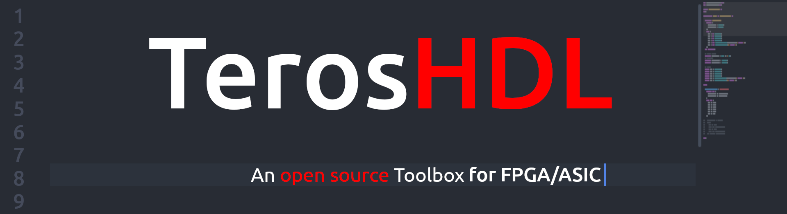
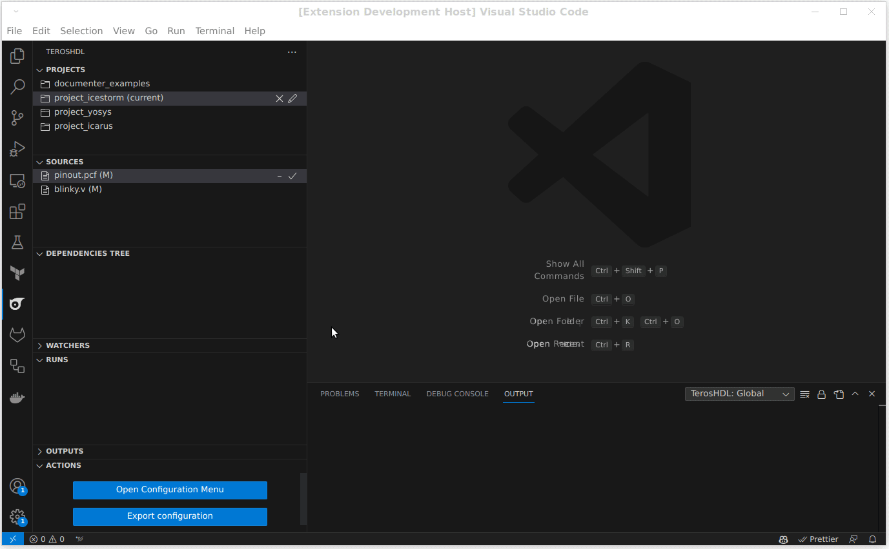

**Check the full documentation:** [https://terostechnology.github.io](https://terostechnology.github.io/)

The goal of TerosHDL is to provide an open source IDE for HDL developers with functionalities commonly used by software developers. The IDE consist in a bunch of tools and on top of them is the VSCode plugin. Some tools are developed by Teros Technology organization and others come from open source projects. All the tools are organized in different backends and exposed to the GUI with the plugin.

The IDE tries to be as much self-contained as possible and simplify the installation process. Features:

- Simulators and tools support: [Raptor](https://rapidsilicon.com/raptor/), Vivado, ModelSim, GHDL, Verilator, Icarus, VCS, Yosys, VUnit, cocotb, Diamond, Icestorm, ISE, Quartus, Radiant, Spyglass, Symbiflow, Trellis, Xcelium... and more!
- Go to definition.
- Hover.
- Hierarchy viewer.
- Dependencies viewer.
- Syntax highlighting.
- Template generator.
- Automatic documentation.
- Verilog/SV schematic viewer.
- Errors linter.
- Style linter: Verible.
- Code formatting.
- State machine viewer.
- State machine designer.
- Code snippets and grammar.

## Managed by

- [Carlos Alberto Ruiz](https://www.linkedin.com/in/carlos-alberto-ruiz-fpga/): carlosruiznaranjo@gmail.com 
- [Ismael Pérez](https://www.linkedin.com/in/ispero/): ismaelprojo@gmail.com

## Sponsor

This project was funded through the NGI Assure Fund, a fund established by NLnet with financial support from 
the European Commission's Next Generation Internet programme, under the aegis of DG Communications Networks, 
Content and Technology under grant agreement No 957073.

