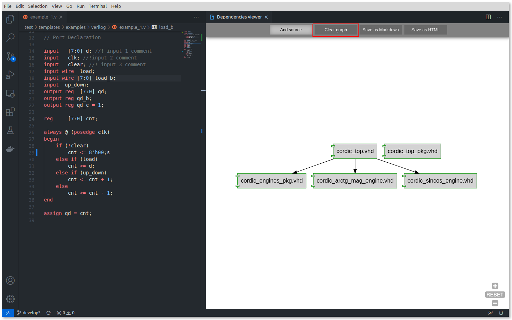

**Index**

1. [Introduction](#id1)
2. [Thanks](#id2)
3. [Go to definition](#id3)
4. [Hover and structure](#id4)
5. [Template generator](#id5)
6. [Documenter](#id6)
7. [Errors checking](#id7)
8. [Style checking](#id8)
9. [Formatting](#id9)
10. [Dependencies viewer](#id10)
11. [Hover to evaluate binary, hexadecimal and octal values](#id11)
12. [Code snippets and grammar](#id12)
13. [Future work](#id13)
14. [Similar projects](#id14)

# 1. Introduction <a name="id1"></a>

Our philosophy is: think in hardware, develop hardware, take advantage of software tools.

The goal of TerosHDL is make the FPGA development easier and reliable. It is a powerful open source IDE.

# 2. Thanks <a name="id2"></a>

- Verilog HDL/SystemVerilog (https://marketplace.visualstudio.com/items?itemName=mshr-h.VerilogHDL)
- VUnit (https://vunit.github.io/)
- VSG (https://github.com/jeremiah-c-leary/vhdl-style-guide)
- Wavedrom (https://github.com/wavedrom/wavedrom)
- VHDL formatter (https://github.com/g2384/VHDLFormatter)

# 3. Go to definition <a name="id3"></a>

You can jump to the definition with Ctrl+Click.


# 4. Hover and structure <a name="id4"></a>

If you hover over a symbol, a preview of the declaration will appear.


# 5. Template generator <a name="id5"></a>

## Supported templates

|   Verilog | VHDL      |
| --------: | --------- |
| Testbench | Testbench |
|    cocotb | cocotb    |
|     VUnit | VUnit     |
|   Signals | Signals   |
| Component | Component |
|  Instance | Instance  |
| Verilator |           |

## Usage Instructions

1. Open a VHDL/Verilog file.
2. Select the template icon.
   
3. Choose a template type.

# 6. Documenter <a name="id6"></a>

## Special comment symbols

You can configure what symbol will be used to extract the comments in the HDL file. It supports MarkDown style. In the following example is used the symbol "!":

```
--! This is a description
--! of the entity.
entity counter is
  port (
    clk: in std_logic; --! Clock comment
    out_data: out std_logic --! Description **port comment**
  );
end counter;
```

## Usage Instructions

1. Open a VHDL/Verilog file.
2. Select the documenter icon.
   
3. TerosHDL will show the generated documentation.
   
4. Export your documentation to PDF, Markdown, HTML or SVG diagram.
5. Edit your VHDL/Verilog file and save it. The preview will show automatically.

## Wavedrom support

TerosHDL supports WaveJSON format in the module description, a format that describes Digital Timing Diagrams:

https://wavedrom.com/tutorial.html


## Bitfield

https://observablehq.com/collection/@drom/bitfield


# 7. Errors checking <a name="id7"></a>

## Supported linters

|   Verilog | VHDL     |
| --------: | -------- |
|  ModelSim | ModelSim |
|    Vivado | Vivado   |
|    Icarus | GHDL     |
| Verilator |          |

## Configuration

One of the above tools has to be installed to have linter functionalities in a languaje. If the tool can not be find in the system path it has to be configured in the plugin config:

Configuration example for verilog:


# 8. Style checking <a name="id8"></a>

## Supported linters

| Verilog | VHDL |
| ------: | :--: |
| Verible |  --  |

## Configuration

# 9. Formatting <a name="id9"></a>

## Supported formatters

| Verilog | VHDL       |
| ------: | ---------- |
|  iStyle | Standalone |

## Configuration

# 10. Dependencies viewer <a name="id10"></a>

## Usage Instructions

1. Open the command palette: `Ctrl+Shift+P` and select **_Open dependencies viewer_**
   
2. Add a HDL files to the viewer (you can mix verilog and VHDL).
   
3. TerosHDL will generate the dependencies graph:
   
4. You can reset your viewer:
   
5. You can generate the indexed Markdown documentation for all the files.
   
6. And the indexed HTML documentation.
   
7. Result in HTML format:
   


# 11. Hover to evaluate binary, hexadecimal and octal values <a name="id11"></a>


# 12. Code snippets and grammar <a name="id12"></a>

| Languaje        | Grammar       | Code snippets |
| ------:         | ----------    | ------------- |
|  Verilog        | &#x2714;      | &#x2714;      |
|  System Verilog | &#x2714;      | &#x2714;      |
|  VHDL           | &#x2714;      | &#x2714;      |
|  XDC/SDC        | &#x2714;      | &#x2714;      |
|  ucf            | &#x2714;      | &#x2718;      |


# 13. Future work <a name="id13"></a>

- Finite State Machine graph.
- Project manager.
- Integrate [triel](https://github.com/TerosTechnology/triel) backend

# 14. Similar projects <a name="id14"></a>

- Hardware Integrated Development Environment ([hide](https://github.com/drom/atom-hide))
- [APIO-ide](https://github.com/FPGAwars/apio-ide)
