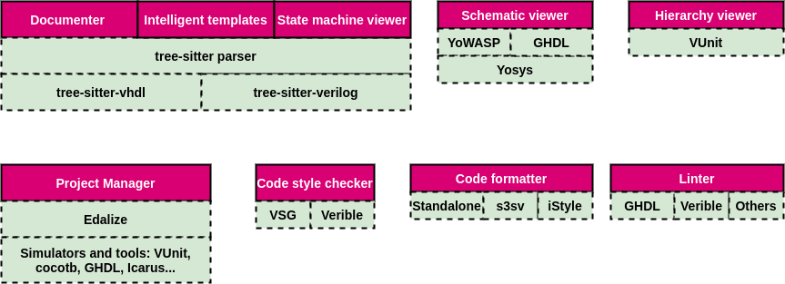

# Colibri2

Colibri2 is a TypeScript library to work with HDL (VHDL, Verilog and SV). It's the back-end of [TerosHDL](https://github.com/TerosTechnology/vscode-terosHDL), but also it can be used as part of other programs. Features:

- State machine parser.
- Schematic images.
- Documenter: it extracts the comments in the code and generates the documentation in HTML or MarkDown.
- Error linter: GHDL, Icarus, Verilator, Verible...
- Style checking: Verible.
- Code formatting.
- Code templates.
- Hierarchy images.
- Dependencies images.
- Projec manager: simulations, compilations...

## Architecture

- [Documenter](./src/documenter)
- [Template](./src/template)
- [State machine](./src/parser)
- [Linter](./src/linter)
- [Formatter](./src/formatter)

## Tests

- [Testing plan](./docs/testing_plan.md)

## Command line

- [Command line](./docs/command_line.md)

## Managed by

- [Carlos Alberto Ruiz](https://www.linkedin.com/in/carlos-alberto-ruiz-fpga/): carlosruiznaranjo@gmail.com 
- [Ismael Pérez](https://www.linkedin.com/in/ispero/): ismaelprojo@gmail.com

## Sponsor

This project was funded through the NGI Assure Fund, a fund established by NLnet with financial support from 
the European Commission's Next Generation Internet programme, under the aegis of DG Communications Networks, 
Content and Technology under grant agreement No 957073.

